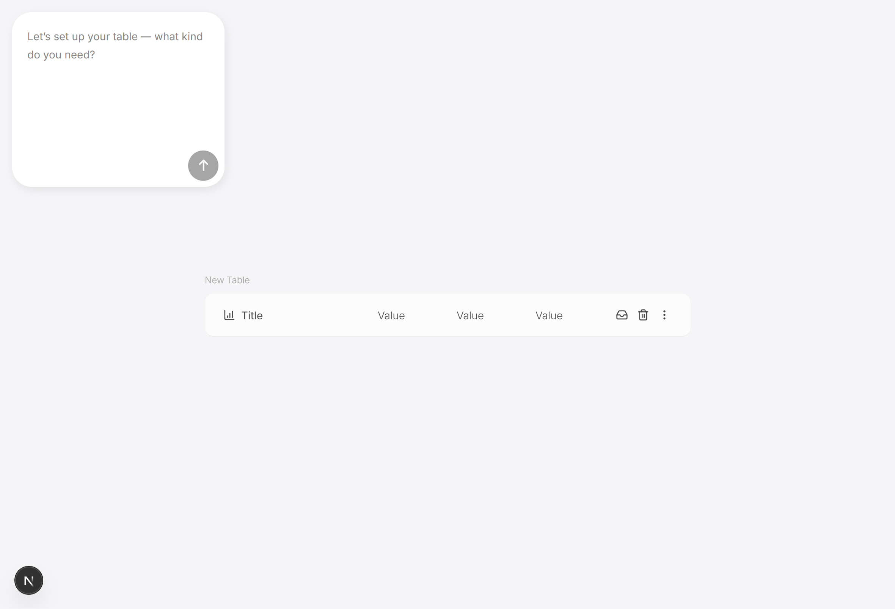

# An AI-powered UI generator

[](LICENSE)
[](https://dladislav.com)

> An experimental project that uses OpenAI's GPT-4o to generate UI-ready table data for a frontend interface. The generated tables include icons, actions, and formatted content, with strict structural and visual rules.

[Live Website](https://ai.dladislav.com)



## Overview

This project enables generating dynamic `UI tables` through natural language prompts powered by `OpenAI GPT-4o`.  
Currently, the system supports only `table generation`, where output is structured and style-ready JSON that can be rendered in a frontend.

## Tech Stack

- [Next.js](https://nextjs.org/)
- [TypeScript](https://www.typescriptlang.org/)

## Getting Started

### Prerequisites

- Node.js (version 18 or later)
- npm

1. Clone the repository

```bash
git clone https://github.com/dladislav201/ai-ui-generator.git
cd ai-ui-generator
```

2. Install dependencies

```bash
npm install
```

3. Run the Application in Development Mode

```bash
npm run dev
```

4. Open [http://localhost:3000](http://localhost:3000) in your browser

## API Endpoints

```
POST /api/table
```

Sends a list of `messages` to OpenAI and expects a valid table definition in response.

**Request Body:**

```json
{
  "messages": [
    { "role": "user", "content": "Generate a table of monthly expenses" }
  ]
}
```

**Response:**

```json
{
  "table": {
    "title": "Company Expenses",
    "cells": [
      [
        { "name": "Cloud Hosting", "icon": "Tag" },
        { "name": "$1,200", "icon": "Tag" },
        { "name": "Feb 1", "icon": "Calendar" }
      ]
    ],
    "actions": ["Save"]
  }
}
```

## Project Structure

```
src/
├── app/
│   ├── api/                   # API route for OpenAI requests
│   ├── layout.tsx             # App-wide layout component
│   ├── page.tsx               # Main entry page
│   └── globals.css            # Global styles
│
├── components/
│   ├── sections/              # Layout-level sections
│   ├── ui/                    # UI-specific components
│   └── index.ts               # Component barrel file
│
├── config/
│   ├── env.ts                 # OpenAI API key and environment config
│   └── index.ts               # Component barrel file
│
├── data/
│   ├── iconConstants.ts       # Enum of allowed icons from lucide-react
│   ├── systemPrompt.ts        # System prompt rules for the AI
│   ├── tableFunction.ts       # OpenAI function schema for generating tables
│   └── index.ts               # Component barrel file
│
├── hooks/                     # Custom hook
└── models/                    # Types
```

## Available Scripts

- `npm run dev` - Run project in development mode
- `npm run build` - Build project
- `npm run start` - Runs the built site in production mode
- `npm run lint` - Lints the code with ESLint
- `npm run lint:fix` - Automatically fix linting issues
- `npm run typecheck` - Checks TypeScript types without emitting files

## License

This project is licensed under the MIT License - see the [LICENSE](LICENSE) file for details.

## Contact

**Vladyslav Dobrodii**
[dobrodii.vlad200@gmail.com](mailto:dobrodii.vlad200@gmail.com)
[LinkedIn](https://www.linkedin.com/in/vladyslav-dobrodii-20384a233/)
[GitHub Repository](https://github.com/dladislav201/ai-ui-generator)
